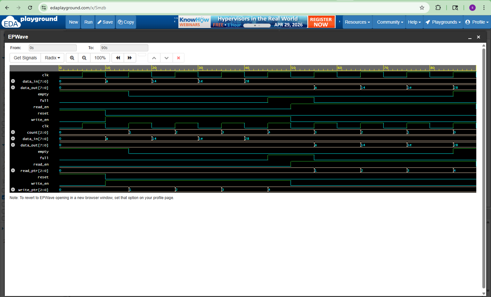

# FIFO Design & Verification

## Overview
This project implements and verifies a FIFO (First In First Out) memory using Verilog and SystemVerilog.

## Features
- FIFO depth: 4
- Data width: 8-bit
- Write operation
- Read operation
- Full and Empty flag handling

## Design (RTL)
The FIFO is implemented using registers with write and read pointers. Data is stored in a memory array and accessed sequentially.

## Verification
A SystemVerilog testbench is used to:
- Apply write and read operations
- Verify data integrity
- Check full and empty conditions
- Generate waveform output

## Tools Used
- Verilog
- SystemVerilog
- EDA Playground
- EPWave (Waveform Viewer)

## Waveform

## Simulation Output
- Data written: 10, 20, 30, 40
- Data read: 10, 20, 30, 40

## Skills Demonstrated
- RTL Design
- Testbench Development
- Functional Verification
- Debugging & Waveform Analysis

- ## How to Run
1. Open EDA Playground
2. Paste design.sv and testbench.sv
3. Select Icarus Verilog
4. Run simulation
5. Open EPWave to view waveform

## Author
Subba Raju Sarikonda
